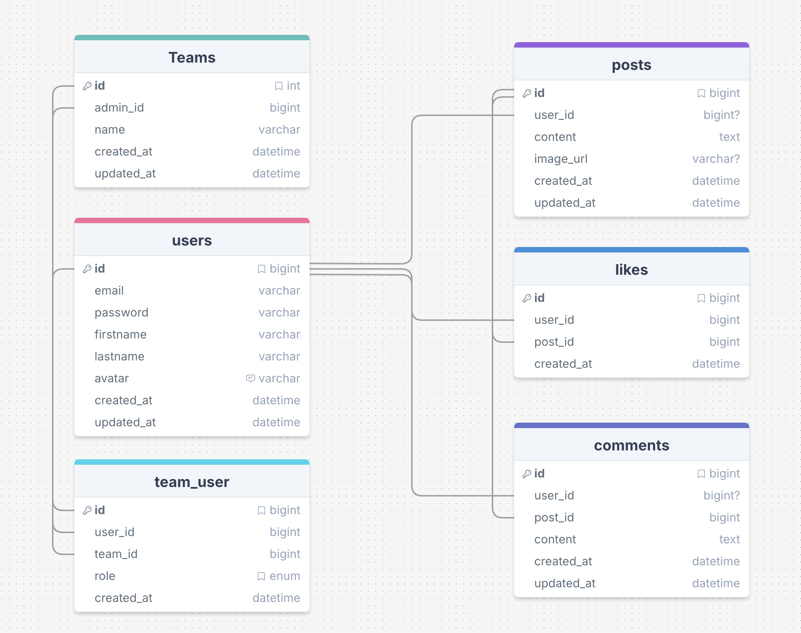

<p align="center">
  <a href="https://github.com/Sofian-bll/ept-connectin">
    
  </a>
</p>

<p align="center">
  <a href="https://github.com/Sofian-bll/ept-connectin/blob/main/LICENSE"></a>
  <a href="https://github.com/Sofian-bll/ept-connectin/releases"></a>
  <a href="https://github.com/Sofian-bll/ept-connectin/stargazers"></a>
</p>

<h1 align="center" id="readme-top">Connect'IN</h1>

<p align="center">
  Internal social network for IT services companies — Laravel REST API + Vue.js
  <br/>
  <br/>
  🇫🇷 <a href="README.md">Français</a> · 🇬🇧 <a href="README.en.md"><b>English</b></a>
</p>

---

<details open>
  <summary>Table of Contents</summary>
  <ol>
    <li><a href="#about">About</a></li>
    <li><a href="#built-with">Tech Stack</a></li>
    <li><a href="#getting-started">Getting Started</a></li>
    <li><a href="#usage">Usage</a></li>
    <li><a href="#roadmap">Roadmap</a></li>
    <li><a href="#contact">Contact</a></li>
    <li><a href="#license">License</a></li>
  </ol>
</details>

---

## About <a id="about"></a>



Connect'IN is an internal social network platform designed for IT services companies. It enables employees to share posts, comment, like, and manage their profile.

The project consists of a Laravel REST API (backend) and a Vue.js interface (frontend).

<p align="right">(<a href="#readme-top">back to top</a>)</p>

## Tech Stack <a id="built-with"></a>

- [](https://laravel.com) — REST API backend
- [](https://vuejs.org) — Frontend SPA
- [](https://www.mysql.com) — Database
- [](https://tailwindcss.com) — Design system
- [](https://www.docker.com) — Containerization
- [](https://www.php.net) — Backend runtime
- [](https://vitejs.dev) — Frontend bundler

<p align="right">(<a href="#readme-top">back to top</a>)</p>

## Getting Started <a id="getting-started"></a>

### Prerequisites

- [Docker](https://orbstack.dev) (OrbStack or Docker Desktop)
- PHP 8.2+
- Composer

### Installation

1. Clone the repository
   ```sh
   git clone https://github.com/Sofian-bll/ept-connectin.git
   cd ept-connectin
   ```

2. Install dependencies and start containers
   ```sh
   make install
   ```

3. Initialize the database (migrations + seeders)
   ```sh
   make fresh
   ```

The backend is accessible at `http://localhost`.

<p align="right">(<a href="#readme-top">back to top</a>)</p>

## Usage <a id="usage"></a>

### Available Commands

| Command | Description |
|----------|-------------|
| `make install` | Initial setup (dependencies + containers + migration) |
| `make up` | Start containers |
| `make down` | Stop containers |
| `make build` | Rebuild Docker images |
| `make migrate` | Run migrations |
| `make fresh` | Reset database (migration + seeders) |
| `make seed` | Run seeders |
| `make shell` | Open a shell in the backend container |
| `make tinker` | Open Laravel Tinker |
| `make routes` | List all API routes |
| `make test` | Run tests |

### Interactive API Documentation

Auto-generated OpenAPI documentation via [Scramble](https://scramble.dedoc.co) is available at:

```
http://localhost/docs/api
```

A Bearer token (obtained via `/api/v1/login`) is required to test protected routes.

### Bruno Collection

A [Bruno](https://usebruno.com) collection is available in the `bruno/` folder for local API testing.

1. Open Bruno and import the `bruno/` folder
2. Select the `local` environment
3. Fill in the Bearer token after login

### Database Diagram

The entity-relationship diagram is available on [DrawSQL](https://drawsql.app).

<p align="right">(<a href="#readme-top">back to top</a>)</p>

## Roadmap <a id="roadmap"></a>

- [x] Auth (register, login, logout)
- [x] CRUD Posts + pagination + media upload
- [x] CRUD Comments
- [x] Likes toggle
- [x] Profile management + avatar
- [x] Account deletion (delete / anonymize)
- [x] Seeders & Factories
- [x] API Documentation (Scramble / OpenAPI)
- [ ] Post filtering and search
- [ ] Notifications (like, comment)
- [ ] Groups / teams

<p align="right">(<a href="#readme-top">back to top</a>)</p>

## Contact <a id="contact"></a>

**Sofian Belloul** — [@Sofian-bll](https://github.com/Sofian-bll)

**Kyllian Rullier** — [@kyllianR](https://github.com/kyllianR)

Project link: [https://github.com/Sofian-bll/ept-connectin](https://github.com/Sofian-bll/ept-connectin)

<p align="right">(<a href="#readme-top">back to top</a>)</p>

## License <a id="license"></a>

Distributed under the MIT License. See [LICENSE](LICENSE) for more information.

<p align="right">(<a href="#readme-top">back to top</a>)</p>
